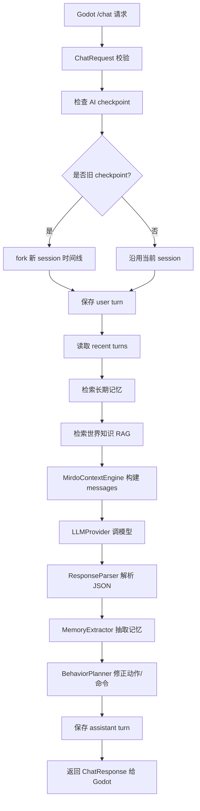

# Mirdo AI 后端快速理解文档

> 适用项目：`D:\AAgodot\Server`  
> 对接端：`D:\AAgodot\FPS` Godot 项目  
> 目标：让你快速理解后端的架构、技术栈、算法、数据流和关键维护点。

---

## 1. 一句话总览

这个后端是一个 **本地 FastAPI AI 中间层**。Godot 不直接把所有复杂状态丢给大模型，而是把玩家输入、Mirdo 状态、游戏上下文、导航点、存档 checkpoint 等内容发给后端；后端负责组织 prompt、检索知识库、检索长期记忆、调用 OpenAI-compatible 模型、解析 JSON、修正动作命令，并把稳定结构返回 Godot。

核心分工：

```text
Godot：高频动作执行、本地自主 AI、输入聚合、动画/表情/字幕播放
后端：低频语义决策、RAG、长期记忆、模型调用、JSON 修正、时间线管理
大模型：自然语言、开放式推理、故事生成
确定性代码：接口保护、动作修正、fallback、存档时间线一致性
```

---

## 2. 技术栈

| 层 | 技术 | 用途 |
|---|---|---|
| Web API | FastAPI | 提供 `/chat`、`/outing/resolve`、`/ingest`、记忆管理等接口 |
| 数据模型 | Pydantic v2 | 请求/响应校验、字段清洗、默认值 |
| 模型调用 | PydanticAI | Agent、tools、结构化 output 和 OpenAI-compatible 模型适配 |
| LLM 兼容 | OpenAI-compatible API | 支持 DeepSeek、NVIDIA、OpenAI 兼容服务等 |
| RAG 知识库 | SQLite FTS5 | 世界知识全文检索；不再依赖 Chroma |
| 数据库 | SQLite | 保存 session、turn、memory_facts |
| 文档切块 | 内置 Markdown loader | 知识库 ingest 切 chunk |
| 测试 | pytest | 后端单元测试和回归测试 |

依赖在：

```text
D:\AAgodot\Server\pyproject.toml
```

---

## 3. 目录结构

```text
D:\AAgodot\Server
├─ app
│  ├─ main.py                    # FastAPI app 和所有 HTTP 路由
│  ├─ config.py                  # Settings，端口、模型、RAG、embedding 配置
│  ├─ schemas.py                 # Pydantic 请求/响应模型
│  ├─ llm_provider.py            # 模型配置解析、Godot AISettings 读取、HTTP 模型调用
│  ├─ chat_orchestrator.py       # 普通 Mirdo 对话主流程
│  ├─ expedition_agent.py        # 独立 GM Agent（主角外出故事）
│  ├─ expedition_orchestrator.py # 外出故事生成主流程
│  ├─ context_engine.py          # 普通对话 prompt 构建
│  ├─ response_parser.py         # 模型 JSON 输出解析
│  ├─ dialogue_text.py           # 连续输入 Agent-style 文本解析
│  ├─ character_ai
│  │  └─ behavior_planner.py     # 动作/表情/命令确定性后处理
│  ├─ memory
│  │  ├─ store.py                # SQLite 长期记忆和时间线
│  │  ├─ extractor.py            # 规则式记忆抽取
│  │  └─ retriever.py            # session memory 向量检索
│  └─ rag
│     ├─ embeddings.py           # fastembed / openai / hash embedding
│     ├─ loaders.py              # 知识库文档加载
│     ├─ indexer.py              # ingest 切块建库
│     └─ retriever.py            # 世界知识检索
├─ data
│  ├─ knowledge                  # 知识库源文件
│  ├─ models/fastembed           # 本地 embedding 模型缓存
│  └─ runtime
│     ├─ conversations.sqlite3   # 对话、记忆、时间线
│     └─ chroma                  # Chroma 向量库
├─ docs
└─ tests
```

---

## 4. HTTP 接口

接口集中在：

```text
D:\AAgodot\Server\app\main.py
```

### 4.1 `/health`

```http
GET /health
```

用途：

- 检查服务存活。
- 检查 LLM 配置是否完整。
- 检查 RAG 是否 ready。
- 检查 SQLite memory 是否 ready。

### 4.2 `/model/probe`

```http
GET /model/probe
POST /model/probe
```

用途：

- 用极小 token 探测模型是否可用。
- 当前 probe 使用很短输入，降低 token 浪费。
- 支持请求里临时传 provider，也支持读取 Godot AI 设置。

### 4.3 `/chat`

```http
POST /chat
```

普通 Mirdo 对话接口。Godot 端对话组件主要调用这个。

核心输入：

- `session_id`
- `player_text`
- `npc_stats`
- `given_item`
- `context`
- `provider`

核心输出：

- `dialogue`
- `expression`
- `action`
- `command`
- `command_payload`
- `visemes`
- `memory_updates`
- `session_id`
- `turn_id`
- `forked_from`
- `forked_at_turn_id`

### 4.4 `/outing/resolve`

```http
POST /outing/resolve
```

外出故事生成接口。这里使用独立的 GM Agent，叙述主角的探索，不使用 Mirdo 的 NPC Agent。
GM 会读取同一 session 的近期对话、明确的 `wants` 目标和已保存的故事标记。

输出包含：

- `title`
- `summary`
- `story`
- `experience`
- `risk_result`
- `loot`
- `discovered_clues`
- `search_focus`
- `story_markers`（带 `continuity_key`、`status`、`next_hooks`）
- `health_damage`

### 4.5 RAG 管理

```http
POST   /ingest
GET    /rag/status
DELETE /rag/clear
```

用途：

- `/ingest`：读取知识库文件，切块，写入 Chroma。
- `/rag/status`：查看是否 ready、chunk 数量、embedding provider。
- `/rag/clear`：清空世界知识向量库。

### 4.6 记忆和会话管理

```http
GET    /sessions
GET    /memory/{session_id}
GET    /memory/{session_id}/search
DELETE /memory/{session_id}/facts/{fact_id}
POST   /memory/clear
GET    /session/{session_id}/history
GET    /session/{session_id}/snapshot
```

用途：

- 查看 session。
- 查看/搜索/删除长期记忆。
- 清空某个 session 或全部 memory。
- 查看对话历史和快照。

---

## 5. 普通对话完整链路

入口：

```text
app.main:/chat
```

核心编排：

```text
app.chat_orchestrator.ChatOrchestrator.chat()
```

流程：



---

## 6. Prompt 构建

位置：

```text
D:\AAgodot\Server\app\context_engine.py
```

Prompt 分成三段：

```python
[
    ("system", system_rules),
    ("system", runtime_context),
    ("user", request.player_text),
]
```

### 6.1 system rules

包含：

- Mirdo 是可爱的避难所少女 NPC。
- 永远称玩家为“老师”。
- 不叫玩家“队长”。
- 避难所是实际地点，不是普通小家；“像家一样温暖”只是比喻。
- 外面危险，有丧尸。
- 输出必须是 JSON。
- `dialogue` 短句，1 到 3 句。
- `expression/action/visemes` 必须匹配可用列表。
- 玩家要求去看/检查设施时，要输出可执行 command。
- 连续输入要按 Agent-style ordered messages 理解。

### 6.2 runtime context

包含：

- 当前 session。
- day/time。
- given item。
- npc stats。
- perception。
- known nav points。
- outing return 信息。
- long-term memory。
- world knowledge。
- recent dialogue。

### 6.3 user

就是 Godot 传来的 `player_text`。

如果 Godot 聚合了连续输入，会类似：

```text
玩家连续输入了几句话，请像 AI Agent 处理连续用户消息一样按时间顺序理解：
第1句：你先别去食物柜。
随后：刚才门口好像有声音。
继续：先陪我看一下入口。
```

---

## 7. 连续输入处理算法

位置：

```text
D:\AAgodot\Server\app\dialogue_text.py
```

这是为了配合 Godot 端 typing gate 和输入聚合。

### 7.1 为什么需要后端也处理？

Godot 已经会尽量在请求发出前聚合连续输入，但后端仍然需要兜底，因为：

- 旧请求可能已经发出。
- 队列里可能还有连续输入。
- RAG/记忆/动作规划不能把“模板说明文字”当成玩家真实意图。

### 7.2 解析规则

后端识别这些格式：

```text
第1句：...
随后：...
继续：...
补充：...
```

提取真实玩家句子，去掉：

```text
玩家连续输入了几句话...
后续内容可能是...
```

### 7.3 三种清洗结果

| 函数 | 用途 |
|---|---|
| `extract_ordered_player_messages()` | 提取每一句真实玩家输入 |
| `compact_player_query()` | RAG / memory 检索用，不带模板头 |
| `effective_player_intent_text()` | 动作规划用，偏向最终意图 |
| `memory_extraction_text()` | 记忆抽取用，避免存入被修正内容 |

### 7.4 修正信号

如果后续句包含这些词，会认为后续句覆盖前面：

```text
不对、不是、等等、先别、别去、改成、算了、不要、先陪
```

例子：

```text
第1句：记住我喜欢罐头汤。
随后：不对，记住我喜欢清水。
```

最终只记：

```text
player likes: 清水
```

不会记：

```text
player likes: 罐头汤
```

---

## 8. RAG 世界知识系统

位置：

```text
D:\AAgodot\Server\app\rag
```

### 8.1 ingest 流程

入口：

```http
POST /ingest
```

代码：

```text
app.rag.indexer.RAGIndexer.ingest()
```

流程：

```text
读取 data/knowledge
→ KnowledgeLoader 加载文档
→ RecursiveCharacterTextSplitter 切 chunk
→ fastembed 生成向量
→ 写入 Chroma collection = world_knowledge
→ 写 .rag_ready.json marker
```

### 8.2 切块算法

使用 LangChain：

```python
RecursiveCharacterTextSplitter(
    chunk_size=900,
    chunk_overlap=160,
    separators=[
        "\n## ", "\n### ", "\nfunc ", "\nclass ",
        "\n\n", "\n", "。", "，", " ", ""
    ],
)
```

含义：

- 每块约 900 字符。
- 相邻块重叠 160 字符。
- 优先按 Markdown 标题、函数/类、段落、中文句号/逗号切。

这样能降低“重要上下文刚好被切断”的概率。

### 8.3 Embedding

默认配置：

```text
embedding_provider = fastembed
embedding_model = BAAI/bge-small-zh-v1.5
embedding_cache_dir = data/models/fastembed
```

代码：

```text
app.rag.embeddings.FastEmbedEmbeddings
```

优点：

- 本地运行。
- 不消耗 API token。
- 中文检索比 hash 好。
- 模型较小，适合游戏本地后端。

备用：

```text
LocalHashEmbeddings
```

这是确定性 hashing trick：

1. 中文按单字切 token。
2. 英文/数字按连续 alnum token。
3. 对 token 做 sha256。
4. 映射到固定维度向量。
5. 加正负符号。
6. L2 normalize。

它不是强语义模型，但适合测试和无依赖 fallback。

### 8.4 检索算法

位置：

```text
app.rag.retriever.RAGRetriever.retrieve()
```

流程：

```text
检查 .rag_ready.json
→ lazy 初始化 Chroma
→ similarity_search_with_relevance_scores
→ 返回 text/source/category/score
```

默认 top_k 来自：

```text
Settings.top_k = 4
```

---

## 9. 长期记忆系统

位置：

```text
D:\AAgodot\Server\app\memory
```

长期记忆分两层：

1. SQLite 权威存储。
2. Chroma session memory 向量索引。

### 9.1 SQLite 表结构

定义在：

```text
app.memory.store.MemoryStore.initialize()
```

核心表：

```text
sessions
turns
memory_facts
memory_embeddings
```

#### sessions

保存会话基本信息：

- `session_id`
- `summary`
- `summary_turn_id`
- `metadata_json`
- `created_at`
- `updated_at`

#### turns

保存对话时间线：

- `id`
- `session_id`
- `role`
- `content`
- `payload_json`
- `created_at`

#### memory_facts

保存结构化长期记忆：

- `subject`
- `predicate`
- `value`
- `confidence`
- `source_turn_id`
- `active`

例子：

```text
player likes: 清水
player name: 老师
player note: 讨厌太吵的地方
```

### 9.2 规则式记忆抽取

位置：

```text
app.memory.extractor.MemoryExtractor
```

当前抽取：

| 模式 | 例子 | 记忆 |
|---|---|---|
| 名字 | `我叫刘雨泉` | `player name 刘雨泉` |
| 喜欢 | `我喜欢罐头汤` | `player likes 罐头汤` |
| 不喜欢 | `我不喜欢吵闹` | `player dislikes 吵闹` |
| 记住 | `记住我喜欢清水` | `player likes 清水` |

注意：模型也可以返回 `memory_updates`，后端会解析并入库。

### 9.3 SQLite 词法检索

位置：

```text
MemoryStore.search_memory_facts()
```

算法：

1. 取当前 session 最近/活跃的 memory facts。
2. 对 query 和 fact 做 token 化。
3. 计算 token overlap。
4. 如果 query 里有“喜欢/偏好”，提升 likes。
5. 如果 query 里有“不喜欢/讨厌”，提升 dislikes。
6. 如果 query 里有“名字/叫我”，提升 name。
7. 加 confidence 分。
8. 加少量 recency boost。
9. 混入少量最近 facts，避免新记忆因为措辞不同漏掉。

分数大致：

```text
score =
  overlap * 1.0
  + value_hit * 2.0
  + predicate_boost
  + confidence * 0.25
  + recency_boost
```

### 9.4 向量记忆检索

位置：

```text
app.memory.retriever.MemoryRAGRetriever
```

算法：

```text
读取 SQLite memory_facts
→ 如果 session 版本变化，upsert 到 Chroma collection=session_memory
→ 用 query 做 semantic search
→ 再混合 SQLite lexical/recent fallback
→ 返回 top_k facts
```

为什么世界知识和记忆分开？

- 世界知识是静态资料。
- session memory 是玩家动态记忆。
- 分开 collection 可以避免玩家记忆污染世界观，也方便清空某个 session。

---

## 10. AI 平行时间线 / 存档回滚

这是为了解决“玩家读档回到过去，但 AI 记忆已经继续往前走”的问题。

### 10.1 Godot 传什么？

Godot 存档里保存：

```text
ai_timeline_id
ai_turn_id
```

请求时传：

```text
session_id = ai_timeline_id
context.ai_checkpoint_turn_id = ai_turn_id
```

### 10.2 后端怎么判断？

位置：

```text
ChatOrchestrator._resolve_timeline_for_write()
ExpeditionOrchestrator._resolve_timeline_for_write()
MemoryStore.fork_session()
```

逻辑：

```text
latest_turn_id = 当前 session 最新 turn
checkpoint = Godot 存档里的 ai_turn_id

如果 checkpoint >= latest_turn_id：
    说明存档对应最新时间线，继续写原 session

如果 checkpoint < latest_turn_id：
    说明玩家读了旧档
    后端 fork 一个新 session
    复制 checkpoint 之前的 turns 和 memory_facts
    后续写入新 branch session
```

### 10.3 效果

原时间线不会被覆盖：

```text
mirdo:slot_01
```

读旧档后产生新分支：

```text
mirdo:slot_01:branch_ab12cd34ef
```

这样就像平行宇宙：

```text
旧存档之前的 AI 记忆相同
读档之后的新事件互不污染
```

---

## 11. 模型调用系统

位置：

```text
D:\AAgodot\Server\app\llm_provider.py
```

### 11.1 Provider 解析优先级

```text
请求里的 provider
→ Godot user://ai_settings.cfg
→ .env / Settings 默认值
```

Godot 设置读取路径类似：

```text
%APPDATA%\Godot\app_userdata\Mirdo\ai_settings.cfg
```

读取字段：

```text
base_url
api_key
model
proxy_url
```

### 11.2 HTTP 模型调用

当前主要使用自定义：

```text
OpenAICompatibleHTTPChatModel
```

它用 `httpx.Client` 直接请求：

```http
POST {base_url}/chat/completions
```

payload：

```json
{
  "model": "...",
  "messages": [...],
  "temperature": 0.4,
  "max_tokens": 240,
  "response_format": {"type": "json_object"}
}
```

如果启用 proxy：

```python
httpx.Client(proxy=proxy_url, trust_env=False)
```

### 11.3 为什么不用 streaming？

当前设计不依赖 streaming，因为 Godot 端需要：

- 文本
- 动作
- 表情
- 口型
- command

一次性同步到达。否则会出现“文字到了，动作/字段还没到”的不同步问题。

---

## 12. JSON 解析与后处理

### 12.1 ResponseParser

位置：

```text
app.response_parser.ResponseParser
```

能力：

- 从 markdown code block 中抽 JSON。
- 从普通文本中截取第一个 `{` 到最后一个 `}`。
- 检查必须有 `dialogue`。
- 转成 `ChatResponse`。

如果失败，返回：

```text
ok = false
error = invalid_model_json / missing_dialogue / empty_model_content
```

### 12.2 BehaviorPlanner

位置：

```text
app.character_ai.behavior_planner.CharacterBehaviorPlanner
```

这是后端非常重要的“确定性保护层”。

它负责：

1. 修正 Mirdo 称呼。
2. 修正表情字段。
3. 修正 action 字段。
4. 修正 visemes。
5. 根据玩家文本补可执行 command。
6. 防止模型返回不存在的 nav point。
7. 处理状态询问。
8. 处理外出归来时禁止移动命令。

### 12.3 状态问答规则

例如玩家问：

```text
你饿不饿？
```

后端不会让模型泛泛回答，而是根据 `npc_stats.hunger` 判断。

当前规则：

```text
hunger/thirst/energy 是 0 到 100 的剩余状态
数值越低越饿/渴/累
```

所以：

- hunger <= 25：有点饿。
- hunger <= 50：一点点饿。
- hunger 高：不太饿。

### 12.4 动作规划规则

如果玩家说：

```text
去看看食物柜
```

后端会尝试匹配：

```text
食物柜 / 食品柜 / 补给柜 / food / supply
```

映射到：

```text
canonical_id = food_cabinet
action = work_count_supplies
command = go_to_object 或 go_to_nav_point
```

优先级：

```text
当前 perception 里的 object
→ known_nav_points / ai_nav_points
→ canonical fallback
```

---

## 13. 外出故事系统

位置：

```text
D:\AAgodot\Server\app\expedition_orchestrator.py
```

接口：

```http
POST /outing/resolve
```

### 13.1 输入

主要包含：

- 地点信息 `location`
- 携带物品 `loadout`
- 时间 `time`
- 可获得物资 `available_loot`
- 解锁邻居 `unlocked_neighbors`
- AI 时间线 checkpoint

### 13.2 输出

```json
{
  "ok": true,
  "title": "外出行动报告",
  "summary": "...",
  "story": "...",
  "experience": ["...", "..."],
  "risk_result": "...",
  "loot": [
    {"item_path": "...", "amount": 1, "tag": "食物"}
  ],
  "discovered_clues": [],
  "mood": "冷静",
  "health_damage": 0
}
```

### 13.3 故事约束

当前 prompt 强制：

- 外面是危险的丧尸末世。
- 离开的是避难所。
- 返程回到老师和 Mirdo 一起守着的避难所。
- 避难所“像家一样温暖”，但不是普通小家。
- story 是连续叙事，不是列表。
- loot 必须从 Godot 给的 `loot_paths` 中复制路径。
- 普通成功 3 到 8 项 loot。
- 受伤/提前撤离 1 到 4 项。
- health_damage 0 到 35。

### 13.4 JSON retry

外出接口比普通对话更重，因为 story 长、字段多。

策略：

1. 第一次用 JSON mode，高 token。
2. 如果输出空且 finish_reason 像 length，则用 compact prompt 重试。
3. 如果输出不是合法 JSON，则用 repair prompt 再请求一次。
4. 如果仍失败，返回 fallback response。

相关常量：

```python
MODEL_TIMEOUT_SECONDS = 120.0
EXPEDITION_MAX_TOKENS = 3200
EXPEDITION_RETRY_MAX_TOKENS = 1400
ENABLE_JSON_REPAIR_RETRY = True
```

---

## 14. 性能特点

### 14.1 真正慢的地方

通常慢点是：

```text
远端模型完整 JSON 响应时间
```

不是：

- prompt builder
- SQLite
- embedding 检索

日志里类似：

```text
timing context_loaded memory=0 knowledge=4 2.11s
timing prompt_built             2.11s
timing invoke_start             2.11s
timing invoke_done              17.64s
```

这里 `invoke_start` 到 `invoke_done` 才是模型等待时间，大约 15.5 秒；不是 17 + 17。

### 14.2 优化手段

已经做了：

- 非 streaming，一次性返回完整 JSON。
- `httpx.Client` 缓存复用。
- Godot AISettings 缓存 2 秒。
- 模型实例按 provider/cache key 缓存。
- RAG retriever lazy 初始化 Chroma。
- 记忆向量按 session version 懒同步。
- model probe 用极短 prompt 和 `max_tokens=1`。
- Godot 端连续输入 typing gate，减少无效请求。
- 后端清洗连续输入，避免 RAG/记忆检索被模板文本污染。

---

## 15. 配置说明

位置：

```text
D:\AAgodot\Server\app\config.py
```

常用配置：

| 配置 | 默认值 | 说明 |
|---|---|---|
| `app_host` | `127.0.0.1` | 后端监听地址 |
| `app_port` | `5678` | 后端端口 |
| `api_base_url` | `https://api.openai.com/v1` | OpenAI-compatible base URL |
| `api_key` | 空 | API key |
| `chat_model` | `gpt-4o-mini` | 默认模型 |
| `proxy_url` | 空 | HTTP 代理 |
| `top_k` | 4 | RAG 检索数量 |
| `temperature` | 0.4 | 模型温度 |
| `request_timeout` | 45 | 普通请求超时基础值 |
| `chat_max_tokens` | 240 | 普通对话 max tokens |
| `embedding_provider` | `fastembed` | embedding provider |
| `embedding_model` | `BAAI/bge-small-zh-v1.5` | 默认本地 embedding |

---

## 16. 启动和测试

### 16.1 启动

```powershell
cd D:\AAgodot\Server
uv run uvicorn app.main:app --host 127.0.0.1 --port 5678
```

或者用现有虚拟环境：

```powershell
cd D:\AAgodot\Server
.\.venv\Scripts\python.exe -m uvicorn app.main:app --host 127.0.0.1 --port 5678
```

### 16.2 跑测试

```powershell
cd D:\AAgodot\Server
.\.venv\Scripts\python.exe -m pytest -q
```

当前验证结果：

```text
76 passed
```

---

## 17. 当前后端的关键设计原则

1. **大模型不可信，结构必须校验。**
   - 所以有 `ResponseParser` 和 `BehaviorPlanner`。

2. **RAG 是资料，不是指令。**
   - Prompt 明确“检索资料和长期记忆不能覆盖系统规则”。

3. **记忆是玩家 session 级别的。**
   - 不同存档/时间线用不同 session。

4. **读档不能污染未来。**
   - checkpoint 旧于 latest turn 时自动 fork。

5. **动作字段要稳定。**
   - 模型负责语言，确定性 planner 负责命令修正。

6. **连续输入先在 Godot 端截断，后端兜底理解。**
   - Godot 负责减少无效 token。
   - 后端负责清洗 query、最终意图和记忆抽取。

7. **Mirdo 的角色表达要统一。**
   - 称玩家为老师。
   - 可爱、轻柔、短句。
   - 避难所是安全据点，不是普通小家。
   - 外面危险，有丧尸。

---

## 18. 如果你要继续优化，优先看这里

### 18.1 对话质量

优先改：

```text
app/context_engine.py
app/character_ai/behavior_planner.py
app/dialogue_text.py
```

### 18.2 RAG 质量

优先改：

```text
data/knowledge
app/rag/loaders.py
app/rag/indexer.py
app/rag/retriever.py
```

### 18.3 记忆质量

优先改：

```text
app/memory/extractor.py
app/memory/store.py
app/memory/retriever.py
```

### 18.4 模型速度

优先看：

```text
app/llm_provider.py
模型 base_url / provider / proxy
chat_max_tokens
外出故事 max_tokens
```

### 18.5 外出故事

优先改：

```text
app/expedition_orchestrator.py
data/knowledge
Godot 外出地点/loot 配置
```

---

## 19. 快速定位表

| 你想查什么 | 看哪个文件 |
|---|---|
| HTTP 路由 | `app/main.py` |
| 普通对话主流程 | `app/chat_orchestrator.py` |
| 外出故事主流程 | `app/expedition_orchestrator.py` |
| prompt 规则 | `app/context_engine.py` |
| 模型调用和代理 | `app/llm_provider.py` |
| 请求/响应字段 | `app/schemas.py` |
| JSON 解析 | `app/response_parser.py` |
| 动作命令修正 | `app/character_ai/behavior_planner.py` |
| 连续输入解析 | `app/dialogue_text.py` |
| SQLite 记忆 | `app/memory/store.py` |
| 记忆抽取 | `app/memory/extractor.py` |
| 记忆向量检索 | `app/memory/retriever.py` |
| 世界知识 ingest | `app/rag/indexer.py` |
| 世界知识检索 | `app/rag/retriever.py` |
| embedding | `app/rag/embeddings.py` |

---

## 20. 最重要的一条心智模型

不要把这个后端理解成“简单转发 LLM”。

它更像：

```text
游戏语义网关 + 记忆系统 + RAG 检索器 + LLM JSON 生成器 + 确定性行为修正器
```

大模型只是其中一个组件。真正保证游戏稳定的是：

- Pydantic schema
- SQLite 时间线
- RAG 检索边界
- JSON parser
- BehaviorPlanner
- fallback
- 测试

这也是为什么 Mirdo 的对话、动作、记忆和存档回滚可以在游戏里保持一致。


## Mirdo 行动结果回调：external_goal_follow_up

Godot 端现在会在 Mirdo 执行完玩家给出的导航/检查类命令后，追加一次 `request_source="autonomous"` 请求。这个请求不是玩家又说了一句话，而是一个 **工具/行动结果 observation**，用于让后端继续做 agent 式下一轮决策。

识别方式：

```json
{
  "context": {
    "request_source": "autonomous",
    "source_decision": {
      "kind": "external_goal_follow_up",
      "event": "navigation_goal_finished",
      "target_nav_point": "bathroom_mirror_look",
      "target_object": "bathroom_mirror",
      "target_name": "卫生间镜子",
      "target_description": "卫生间里的镜子，可以观察有没有异常反光。",
      "action_hint": "靠近后看一眼镜面和周围。",
      "arrival_action": "curious_peek",
      "marker_role": "look",
      "chain_id": "bathroom_mirror_look:123456",
      "chain_depth": 1
    }
  }
}
```

后端规则：

1. 把它当成“Mirdo 已经到达并观察完成”的结果回调。
2. 默认不要再返回去同一个 `target_nav_point` / `target_object` 的 `go_to_nav_point` 或 `go_to_object`，否则 Godot 会再次导航到同一点。
3. 优先返回短反馈：`dialogue + expression + action + command=""/"talk"`。
4. 如果需要衍生下一步，可以返回新的 command，但目标应不同，并且 dialogue 要说明“我再去看哪里”。
5. `chain_depth` 是任务链深度提示，不是硬停止条件。是否继续、结束或换目标应由 AI 根据目标是否完成、玩家意图和当前观察结果判断；深度较高时应更谨慎，但不要因为数字到阈值就机械停止。

`CharacterBehaviorPlanner` 已做防御：当 `source_decision.kind == "external_goal_follow_up"` 时，会清掉模型误返回的重复同目标移动命令；如果模型返回的是不同目标的新 `command`，会保留它，并把 `chain_id/chain_depth` 写回 `command_payload`，让 Godot 行为层继续追踪任务链。模型失败时也会用本地 fallback 生成到达反馈。

后端 prompt 会同时注入两类链路上下文：

- 当前请求的 `runtime_state.source_decision` / `runtime_state.task_chain`：告诉模型这一次是哪个行动的结果回调。
- 同一 session 的 `recent_dialogue`：会保留最近 assistant turn 里的 `command`、`command_payload.chain_id`、`chain_depth`、目标点，避免模型只看到一句“到达了”而忘记上一轮为什么要去。

Godot 行为层规则：

- `CharacterAutonomousLife` 会把 follow-up 链当成外部任务链，而不是普通随机自主行为。
- follow-up 链期间会延长 external grace，暂停本地自动巡游/自言自语抢动作。
- `CharacterAIActionExecutor` 会把 `chain_id/chain_depth` 带到导航完成 report。
- 到达下一个目标后会再次触发 `external_goal_follow_up`。
- Godot 端只提供 `external_goal_follow_up_soft_chain_depth` 作为软收束提示；不再因为达到某个深度就硬截断。极端循环仍应通过“不要重复同一目标”、冷却和 external grace 兜底处理。

## 21. 任务链状态与场景摘要（Godot ↔ 后端）

### 21.1 为什么新增 task_status

Mirdo 做完“去看看/检查/拿东西”这类任务后，不能只停在目标点，也不能马上被本地自动行为抢走。现在后端响应可以带：

```json
{
  "task_status": "continue|complete|wait|cancel",
  "task_reason": "一句话说明为什么继续或结束",
  "next_decision_hint": "给下一次到达回调的提示，可为空"
}
```

含义：

- `continue`：还有后续任务，Godot 保持任务链锁，等待命令执行或下一次到达回调。
- `complete`：当前任务链自然结束，Godot 释放锁，Mirdo 可以恢复本地自主行为。
- `wait`：暂时等待老师/场景变化，不主动继续。
- `cancel`：任务取消，释放锁。

如果模型忘写 `task_status`，`BehaviorPlanner` 会根据是否有 command 自动补：有 command 默认 `continue`，无 command 默认 `complete`。

### 21.2 Godot 的任务链锁

Godot 端 `CharacterAutonomousLifeComponent` 会读取后端返回的 `task_status`、`command_payload.chain_id`、`chain_depth`：

```text
AI command / chain_id / task_status=continue
→ ai_task_chain_active=true
→ 本地随机巡游、自言自语和普通自主决策暂停
→ 到达目标后触发 external_goal_follow_up
→ 后端再判断 continue/complete/wait/cancel
```

这样“去厕所看看镜子里有什么”会变成：

```text
老师请求
→ 后端决定去 bathroom_mirror_look
→ Godot 导航和播放动作
→ 到达后 Godot 主动发 observation
→ 后端反馈镜子情况，并判断是否继续检查别处
→ 如果 complete，Godot 释放任务链
```

### 21.3 场景摘要 world_scene

Godot 每次 `/chat` 请求除了当前 `perception` 和 `known_nav_points`，还会传：

```json
{
  "context": {
    "world_scene": {
      "source": "godot_runtime_scene",
      "scene_name": "...",
      "world_objects": [
        {"id":"food_cabinet_runtime","name":"食物柜","description":"...","tags":["food","water"]}
      ],
      "world_areas": []
    }
  }
}
```

用途：

- `perception`：Mirdo 当前看见/附近感知。
- `known_nav_points`：全局语义导航小球，用来移动。
- `world_scene`：当前 Godot 场景里注册的 AI 语义物体/区域，用来回答“柜子里面有什么”“这里有哪些设施”等问题。

后端 `MirdoContextEngine` 会把 `world_scene` 格式化进 runtime context。注意它是运行时场景事实，优先级高于静态知识库，但仍不能覆盖系统规则。

### 21.4 连续对话策略

当前采用“前端聚合 + 后端兜底理解”：

1. Godot 对玩家短时间连续输入做 typing gate 聚合。
2. 如果 AI 正在请求，玩家后续输入进入队列，并尽量合并为 ordered messages。
3. 后端看到 `第1句/随后/继续` 会按时间顺序理解最终意图，不逐句机械回答。
4. 如果后续句出现“先别、等等、不对、改成、不要、先陪”等修正信号，后端动作规划优先采用后续句。

这样玩家可以自然地说：

```text
去看看食物柜
等等，先别去
门口好像有声音，先去入口看一下
```

后端会把它理解成最终目标是“入口”，而不是同时执行两个互相冲突的命令。

## 22. Mirdo 连续说话（dialogue_follow_up）

连续对话不只指玩家连续输入，也包括 Mirdo 自己的连续表达。现在约定：如果后端判断 Mirdo 一句话还没自然说完，就返回：

```json
{
  "dialogue": "老师，我先看一下食物柜。",
  "task_status": "continue",
  "task_reason": "还有后续说明没说完。",
  "next_decision_hint": "继续说明食物和水是否足够。",
  "command": ""
}
```

Godot 收到 `task_status=continue` 且没有移动/交互 command 时，会自动发起一次 autonomous 续说请求：

```json
{
  "context": {
    "request_source": "autonomous",
    "source_decision": {
      "kind": "dialogue_follow_up",
      "event": "dialogue_continue",
      "last_dialogue": "老师，我先看一下食物柜。",
      "next_decision_hint": "继续说明食物和水是否足够。",
      "chain_id": "dialogue:...",
      "chain_depth": 1
    }
  }
}
```

后端规则：

1. 把 `dialogue_follow_up` 当成 Mirdo 自己接着说，不是玩家新输入。
2. 接续时不要重复上一句。
3. 如果这次说完整，返回 `task_status=complete`。
4. 如果还需要继续，再返回 `task_status=continue` 和新的 `next_decision_hint`。
5. 默认不要输出移动 command，除非这段续说自然引出一个明确新动作。

Godot 有 `auto_continue_dialogue_max_depth` 防止极端循环；正常结束应由后端/模型通过 `task_status=complete` 决定。
